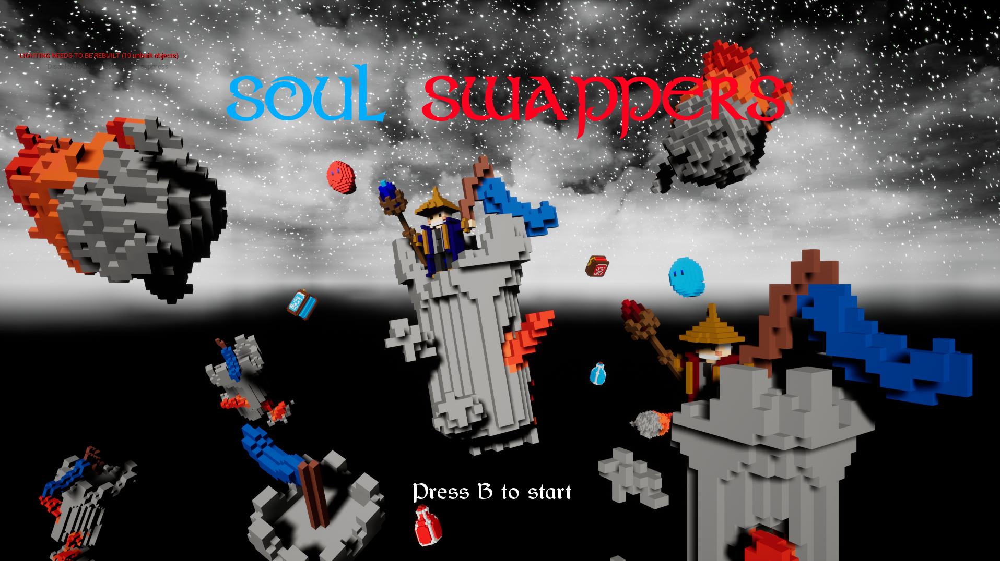
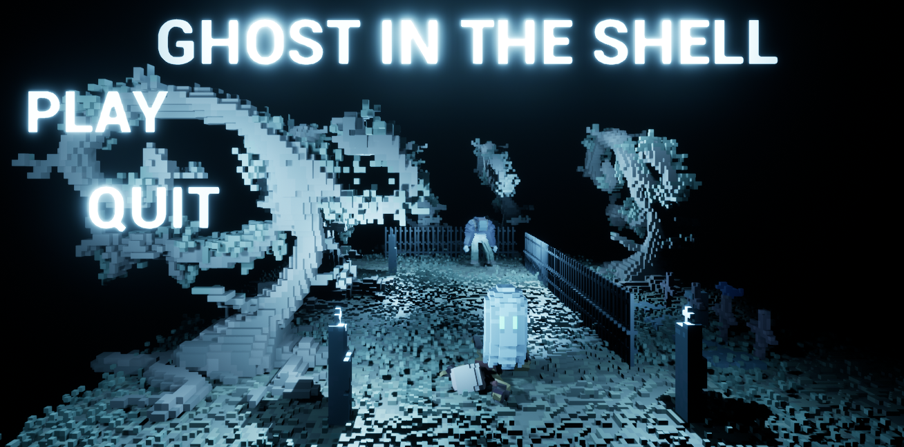
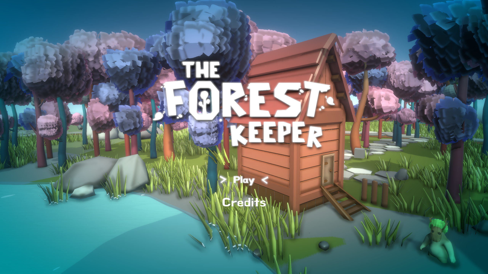
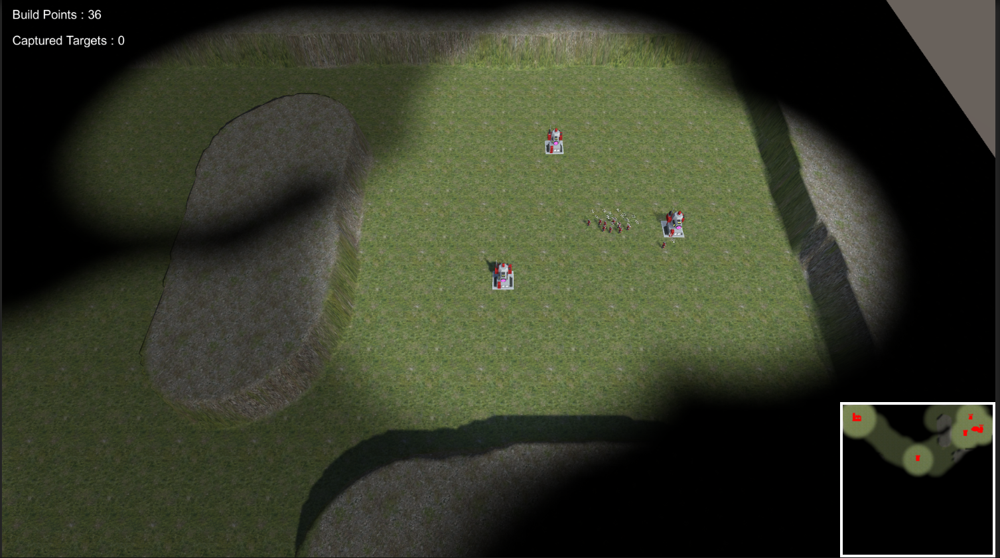
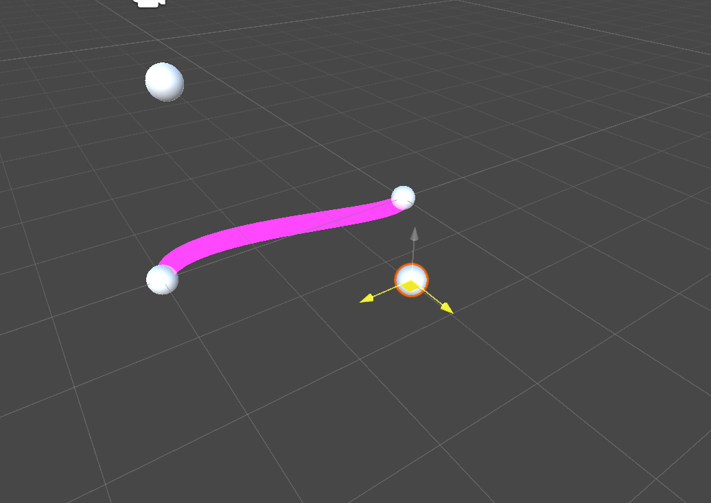
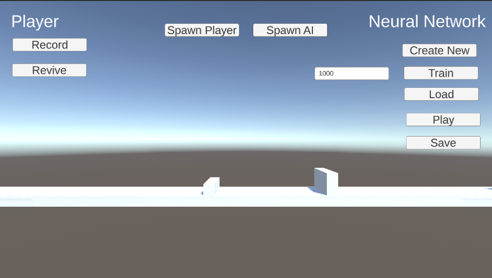
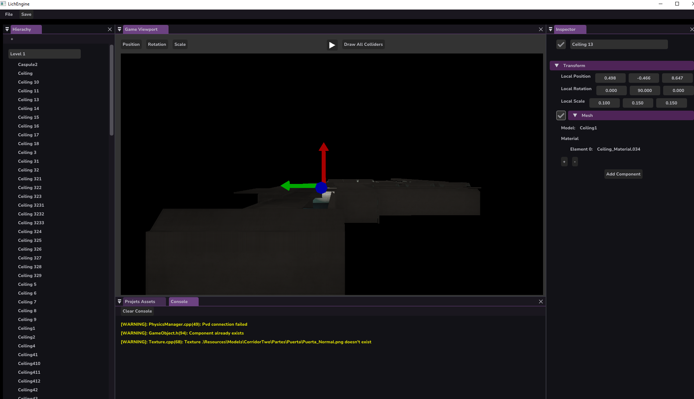
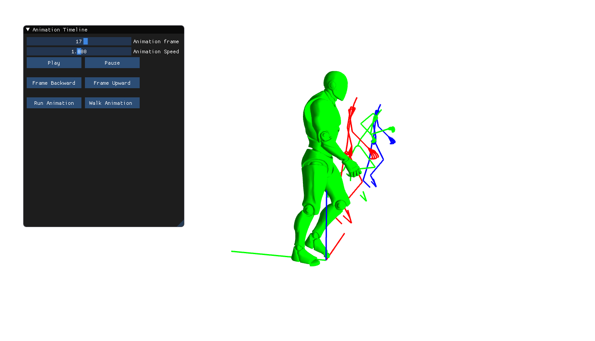
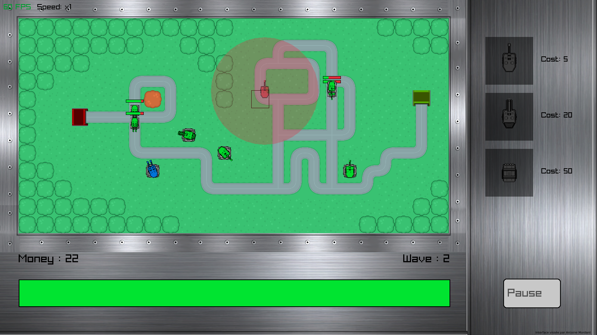

# Antoine Mordant

I am currently a first-year master's student in Game Programming at ISART DIGITAL Paris.

Throughout my various projects, I have gained proficiency in multiple programming languages, with a particular focus on C++ and C#.

My primary experience lies in developing projects using Unity, Unreal Engine 4 and Unreal Engine 5. Additionally, I have created custom game engines utilizing OpenGL and Vulkan.

Please feel free to explore my projects at your convenience.

## Summary

* [Unreal Engine 4](#unreal-engine-4)
    * [Birdmancer](#birdmancer)
    * [Soul Swappers](#soul-swappers)
    * [Unreal Platformer](#unreal-platformer)
* [Unreal Engine 5](#unreal-engine-5)
* [Unity](#unity)
    * [The Forest Keeper](#the-forest-keeper)
    * [RTS](#rts)
    * [Spline Editor](#spline-editor)
    * [Neural Network](#neural-network)
* [Custom Engines](#custom-engine)
    * [Lich Engine](#lich-engine)
    * [Python Scripting](#python-scripting)
    * [Multithreading](#multithreading)
    * [Animation Programming](#animation-programming)
* [Others](#others)
    * [Tower Defense](#tower-defense)

## Unreal Engine 4

### [Birdmancer](https://github.com/StarlaToR/Birdmancer)

### [Soul Swappers](https://github.com/StarlaToR/SoulSwappers)

### [Unreal Platformer](https://github.com/StarlaToR/UnrealPlatformer)

## Unreal Engine 5

    Coming soon ! 

## Unity

### [The Forest Keeper](https://github.com/StarlaToR/TheForestKeeper)

### [RTS](https://github.com/StarlaToR/AI_RTS)

### [Spline Editor](https://github.com/StarlaToR/SplineEditor)

### [Neural Network](https://github.com/StarlaToR/NeuralNetwork)

## Custom Engine

### [Lich Engine](https://github.com/StarlaToR/LichEngine)

### [Python Scripting](https://github.com/StarlaToR/PythonScripting)

### [Multithreading](https://github.com/StarlaToR/MultiThreading)

### [Animation Programming](https://github.com/StarlaToR/AnimationProgramming)

## Others

### [Tower Defense](https://github.com/StarlaToR/TowerDefense)

